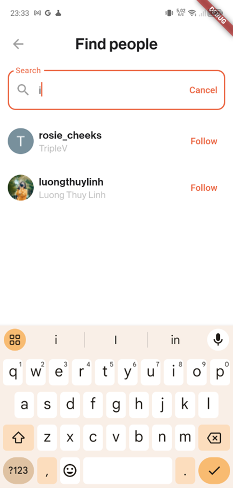
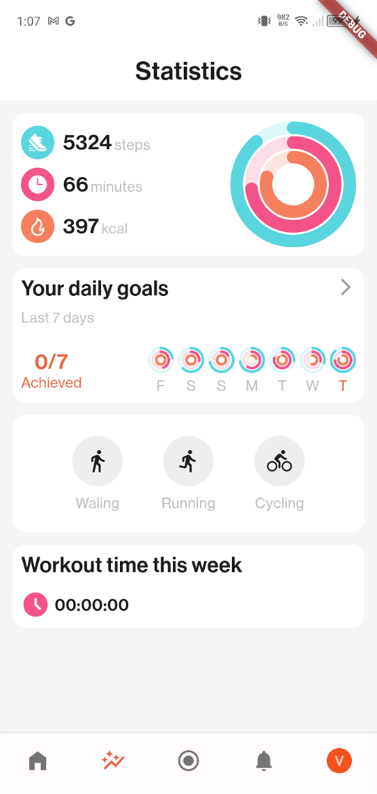
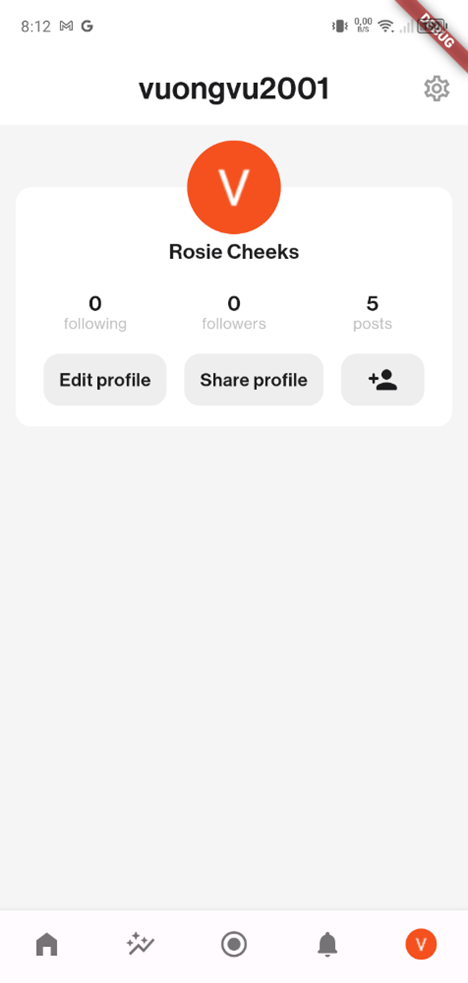

# vHealth

The project is about health and fitness monitoring with the aim of changing people's exercise habits and making their fitness journey exciting and enjoyable. The app tracks users' daily activities and provides insights into their fitness progress. Furthermore, it allows users to record fitness activities and make recording social, fostering connections between exercisers and building a fitness community.

## Tech Stacks
**Frontend:** Flutter

**Backend:** ExpressJS, Neo4j, SQLite, Firebase

## Key Features

- **Authentication**

You can log in or sign up with Google.

| Sign in | | Sign up |
|---------|-|---------|
|  |  |  |

- **Activity Feed**

Public fitness activities of people you follow will appear on your activity feed. Besides, you can react to and comment on any public post.

| | |
|-|-|
|  |  |

You can tap a post to see workout stats including fitness metrics, charts, routes taken, and more. Moreover, you can view details of the route taken, view photos the user took while exercising on the map, and more.

| | | | |
|-|-|-|-|
|  |  |  |  |

- **Post Interaction**

You can view a list of reactions to a post, comment on posts, reply to others, and more.

| React to posts | Comment on posts | Reply to others |
|----------------|------------------|-----------------|
|  |  |  |

- **Making Friends**

You can search for people and follow or unfollow them.

| |
|-|
|  |

- **Recording Activities**

You can record fitness activities including walking and running, set targets, take photos, and more. You can view your route, metrics, photos, etc. throughout the journey.

| | | | |
|-|-|-|-|
|  |  |  |  |

Once you are done, you can make your workout journey social. The post will appear on your friends' feeds.

| |
|-|
|  |

- **Tracking Daily Activities**

The system will automatically track your daily steps even when your phone screen is off, then calculate active minutes and calories burnt. Furthermore, you can set goals for fitness metrics. You can view statistics on your progress by hour, day and month.

| | | |
|-|-|-|
|  |  |  |

Below are statistics on your progress towards your goals during the day.

| | | |
|-|-|-|
|  |  |  |

Below are statistics on your progress towards your goals during the week.

| | | |
|-|-|-|
|  |  |  |

Below are statistics on your progress towards your goals during the month.

| | | |
|-|-|-|
|  |  |  |

Below are statistics on your progress towards your goals during the year.

| | | |
|-|-|-|
|  |  |  |

- **Profile**

You can view your profile make changes if you want.

| | |
|-|-|
|  |  |
